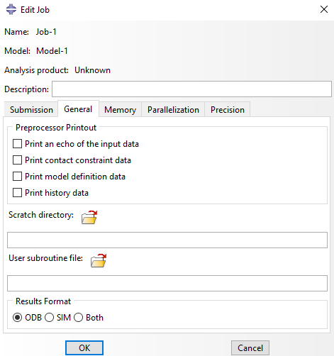
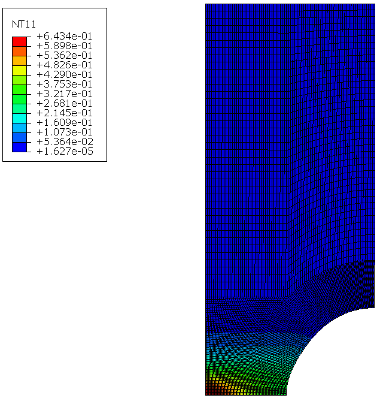

# Lemaitre-damage-UMAT
Lemaitre non-local damage user sub-routines for Abaqus software (public)

## Overview

This repository contains implementations of the non-local Lemaitre damage model. It takes advantage of Abaqus' software in-built ability to solve the (steady-state) heat equation to solve the non-local gradient equations by analagous treatment of these equations. For more information on this analagous treatment see Navidtehrani et al. (Doi - 10.3390/ma14081913). In addition, a axisymmetric notched bar test case is provided.

## Usage

1. nonLocalLemaitre: compatible with Abaqus/2020 or newer
2. HETVAL_nonLocalLemaitre: Compatible with older versions of Abaqus (at least as old as Abaqus/2018)

To run using the Abaqus GUI, select file-->import in the menu bar and select the .inp file.
Create a new Job and link the user sub-routine (the .f file) using the 'User subroutine file' option

<p float="center">
  <br>
   
</p>

To run case using Abaqus command enter relevant directory and enter the following commands:

- for nonLocalLemaitre
```
$ abaqus job=axiSymmetricNotchedBar.inp user=lemaitreDamageNonLocal.f interactive
```
- for HETVAL_nonLocalLemaitre
```
$ abaqus job=HETVAL_axiSymmetricNotchedBar.inp user=HETVAL_lemaitreDamageNonLocal.f interactive
```

### Example Result:
<p float="center">
  <br>
   
</p>
